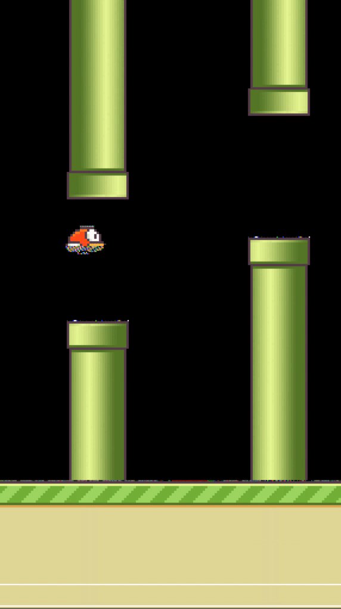
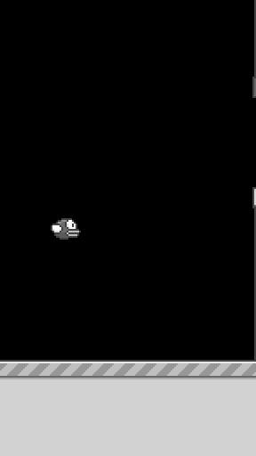
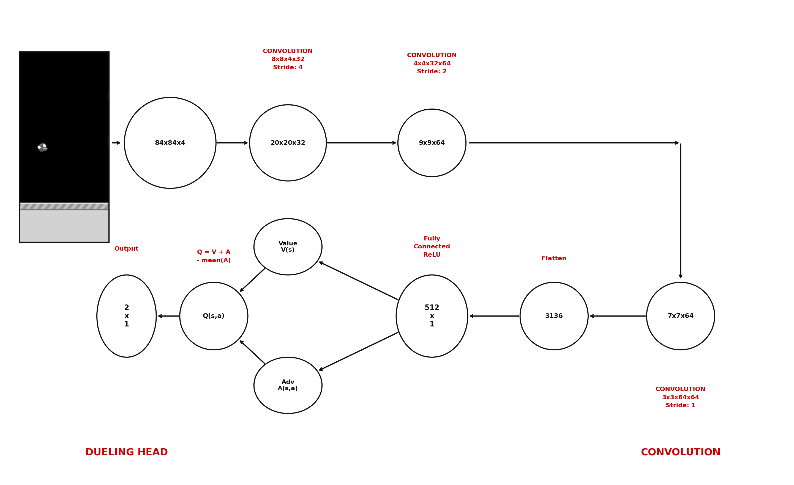

# Flappy Bird — Double DQN

| RGB | Grayscale | Threshold |
|:---:|:---:|:---:|
|  |  |  |

Deep Reinforcement Learning agent that learns to play Flappy Bird from raw pixels using PyTorch.

## Features

- **Dueling CNN** — separate Value V(s) and Advantage A(s,a) streams
- **Double DQN** — policy net selects action, target net evaluates, eliminates overestimation bias
- **Soft τ-update** — target network updated every step with τ=0.005
- **Prioritized Experience Replay (PER)** — high TD-error transitions sampled more frequently
- **Protected replay segment** — first 10% of buffer never overwritten, prevents catastrophic forgetting
- **Brightness jitter augmentation** — random ×(0.85–1.15) on training batches
- **3-mode preprocessing ablation** — grayscale / threshold / rgb
- **WandB logging** — score, loss, Q-max, epsilon, beta tracked per episode
- **Separated train / test scripts**

## Preprocessing

Raw game frames are preprocessed before being fed to the network:


Three modes available via `--mode`:
- `grayscale` — resize to 84×84, convert to grayscale, stack 4 frames → (4, 84, 84)
- `threshold` — same as grayscale, then binarize at 127 → pure black/white
- `rgb` — resize to 84×84, keep RGB, stack 4 frames → (12, 84, 84)

## Network Architecture



Three convolutional layers feed into two separate streams (Dueling architecture):
- **Value stream** — estimates how good the current state is
- **Advantage stream** — estimates relative value of each action

Output: `Q(s,a) = V(s) + A(s,a) − mean(A(s,·))`

## Results

Evaluated over 50 episodes:

| Mode | Mean score | Max score |
|---|---|---|
| Grayscale | 19.52 | 66 |
| Threshold | **282.12** | **1221** |
| RGB | 124.68 | 561 |

### Score comparison — all 3 modes


### Grayscale baseline — learning curve


### Loss


### Q-max


## Installation

```bash
# GPU (CUDA 12.1)
pip install torch==2.1.0 --index-url https://download.pytorch.org/whl/cu121
pip install "numpy<2" pygame opencv-python wandb filelock sympy networkx typing-extensions

# CPU-only
pip install torch==2.1.0+cpu --index-url https://download.pytorch.org/whl/cpu --no-deps
pip install "numpy<2" pygame opencv-python wandb filelock sympy networkx typing-extensions
```

## Training

```bash
python train.py                      # grayscale (default), WandB on
python train.py --no-wandb           # disable WandB
python train.py --mode threshold     # threshold ablation
python train.py --mode rgb           # rgb ablation
python train.py --episodes 2000      # custom episode count
```

Training always resumes from the latest checkpoint in `checkpoints/<mode>/`.

## Evaluation

```bash
python test.py                       # latest grayscale checkpoint, headless
python test.py --mode threshold      # evaluate threshold agent
python test.py --mode rgb            # evaluate rgb agent
python test.py --episodes 50         # 50 evaluation episodes
python test.py --render              # show game window
```

When `--render` is used, the game window automatically displays in the agent's preprocessing mode — grayscale shows a grey display, threshold shows pure black/white, and rgb shows full colour. This lets you see exactly what the agent perceives during play.

## Project Structure

```
flappy-bird-dqn/
├── train.py             — training loop, WandB logging, checkpoint resume
├── test.py              — evaluation script
├── agent.py             — DoubleDQNAgent
├── model.py             — DuelingCNN architecture
├── replay_buffer.py     — PrioritizedReplayBuffer
├── preprocess.py        — frame preprocessing (3 modes)
├── config.py            — all hyperparameters
└── checkpoints/
    ├── grayscale/
    ├── threshold/
    └── rgb/
```

## References

- Mnih et al. **Human-level Control through Deep Reinforcement Learning**. Nature, 2015.
- van Hasselt et al. **Deep Reinforcement Learning with Double Q-learning**. AAAI, 2016.
- Wang et al. **Dueling Network Architectures for Deep Reinforcement Learning**. ICML, 2016.
- Schaul et al. **Prioritized Experience Replay**. ICLR, 2016.
